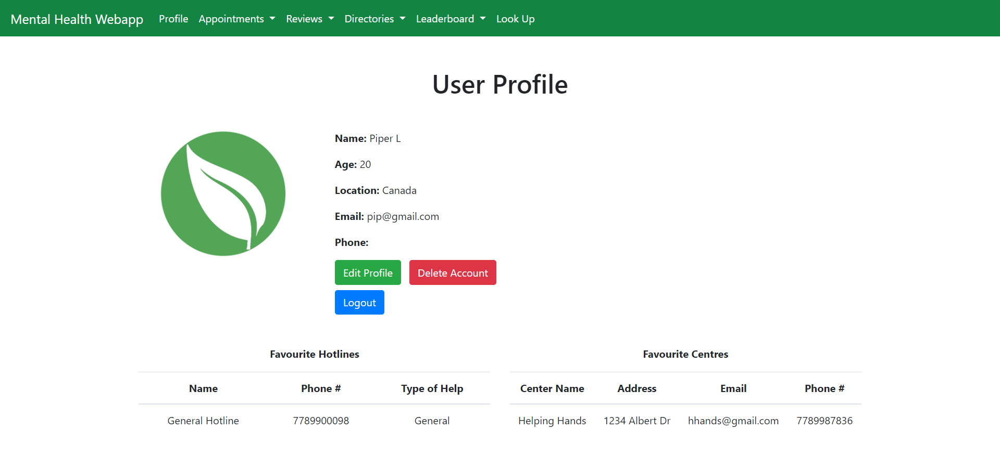
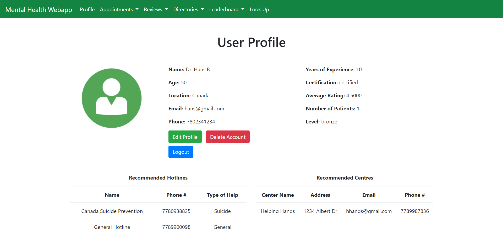

# Mental Health Webapp

An all-in-one platform that helps users get connected with certified counsellors and resources.

  

  

## :star: Introduction

A mental health networking and help web-app dedicated to those seeking and offering help. We have found that many mental health resources around the web are decentralized and inconvenient to navigate, which it should not be. We wanted to create an app that acts as a directory, social media, and support service–all surrounding mental health.

Our target audience are help seekers or counsellors–help seekers are anyone who requires mental health support and counsellors are any who are in the process of/are certified. Our app acts as a one-stop-shop for one’s mental health resources, whether that be hotlines, resource centres, or even to search and book potential counsellors. Counsellors can provide assistance and recommend hotlines/resource centres. The database contains information about all users, from help seekers, their appointments, and top counsellors, which the app allows them to browse once they log in. Our app helps counsellors maintain their business (especially in the midst of COVID-19) by allowing appointment bookings and a review/search system for them by other users.

## :pushpin: Features 
- Login or sign up as a new user
- Edit or delete a user profile
- Book and view appointments with other users
- Write and view reviews for counsellors
- Find mental health hotlines and resource centres

